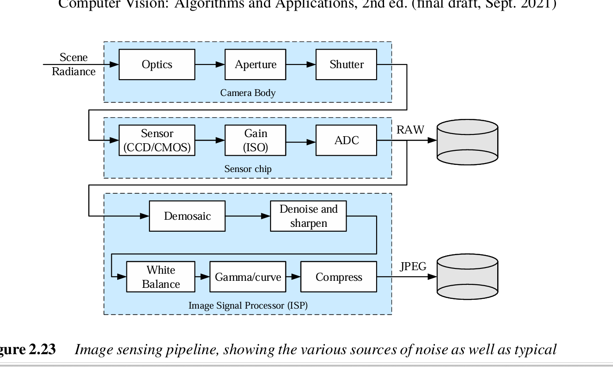

# Digital Camera Image Sensing Pipeline 



## What is This Diagram?

This diagram shows the complete **Image Sensing Pipeline** of a digital camera. It shows how light from the real world becomes a digital image (RAW or JPEG) stored in memory. There are **3 main stages** in this pipeline.

---

# STAGE 1: Camera Body

## What Happens Here?

The Camera Body is the **first stage** where real-world light enters the camera and is controlled before hitting the sensor.

### Step 1: Scene Radiance (Input)

Scene Radiance is the **light coming from the real world** into the camera lens.

```
Real World Scene
      ↓
Light (photons) travel into camera
      ↓
This light carries all color and brightness information
```

Think of it as: You point the camera at a tree. The light reflected from the tree enters the camera. This light is called "Scene Radiance."

### Step 2: Optics (Lens)

The optics system is the **lens of the camera**.

What it does:
- Focuses light onto the sensor correctly
- Controls field of view (wide angle or zoom)
- Determines sharpness and focus
- Bends incoming light rays so they converge perfectly

If optics are bad → Image is blurry, distorted, or out of focus. This is the first source of image quality problems.

### Step 3: Aperture

Aperture is a **small hole that controls how much light enters**.

```
Small Aperture (f/16):       Large Aperture (f/1.8):
    ●                              ◯
  (tiny hole)                  (big hole)
  Less light enters            More light enters
  More depth of field          Less depth of field
```

What it controls:
- How much light hits the sensor
- Depth of field (how much of the image is in focus)
- Too much light → overexposed (too bright) image
- Too little light → underexposed (too dark) image

### Step 4: Shutter

Shutter is a **mechanical curtain that controls HOW LONG light hits the sensor**.

```
Fast Shutter (1/1000 sec):
- Light hits sensor for very short time
- Freezes moving objects
- Less total light captured

Slow Shutter (1/10 sec):
- Light hits sensor for longer time
- Moving objects appear blurry (motion blur)
- More total light captured
```

What shutter controls:
- Exposure time (duration of light collection)
- Motion blur (fast objects frozen or blurred)
- Noise levels (longer exposure = more noise)

---

# STAGE 2: Sensor Chip

## What Happens Here?

After light passes through the Camera Body, it hits the **Sensor Chip**, which converts light into electrical signals.

### Step 5: Sensor (CCD/CMOS)

The sensor is the **"digital film"** of the camera. It converts light (photons) into electrical signals (voltage).

**CCD (Charge-Coupled Device):**
- Higher quality images
- More expensive
- Used in scientific cameras
- Slower to read data
- Better sensitivity in low light

**CMOS (Complementary Metal-Oxide Semiconductor):**
- Cheaper to manufacture
- Faster readout speed
- Used in most modern cameras and phones
- More noise than CCD (but improving)
- Lower power consumption

```
How it works:
Light photon hits sensor pixel
        ↓
Knocks electrons loose (photoelectric effect)
        ↓
Electrons collected as electrical charge
        ↓
More light = more electrons = stronger signal
```

**Important concept**: The sensor uses a **Bayer Pattern** (color filter array). Each pixel only captures ONE color (Red, Green, or Blue). The missing colors are calculated later (in Demosaic stage).

```
Bayer Pattern on sensor:
R  G  R  G  R  G
G  B  G  B  G  B
R  G  R  G  R  G
G  B  G  B  G  B

Each pixel only captures one color!
50% green, 25% red, 25% blue
(More green because human eye is most sensitive to green)
```

### Step 6: Gain (ISO)

ISO controls the **amplification (sensitivity) of the electrical signal**.

```
Low ISO (100):
- Small amplification
- Less sensitive to light
- Need bright conditions
- Clean, low-noise image ✓

High ISO (6400):
- Large amplification
- Very sensitive to light
- Works in dark conditions
- Noisy, grainy image ✗
```

**Why noise increases with ISO?**

```
Signal:  [real image data]
Noise:   [random electrical fluctuations]

At low ISO: Signal amplified little
  Result = Signal (large) + Noise (small) → Clean image

At high ISO: Everything amplified a lot
  Result = Signal (large) + Noise (LARGE) → Grainy image
```

**This is a major source of noise in digital cameras!**

### Step 7: ADC (Analog to Digital Converter)

ADC converts **analog electrical signals to digital numbers**.

```
Analog signal (continuous):
~~~~wave~~~~  →  Voltage = 2.347 volts (can be any value)

Digital signal (discrete):
After ADC  →  Value = 156 (out of 255 for 8-bit)

8-bit = 256 levels (0 to 255)
12-bit = 4,096 levels (more detail preserved)
14-bit = 16,384 levels (even more detail)
```

After ADC → Data saved as **RAW file** (raw, unprocessed digital data from sensor)

**RAW file contains**: All original sensor data, uncompressed, unprocessed. Professional photographers use RAW because it preserves maximum information.

---

# STAGE 3: Image Signal Processor (ISP)

## What Happens Here?

The ISP takes the RAW digital data and **processes it into a viewable image**. This is where most image quality decisions are made.

### Step 8: Demosaic

Remember: Each sensor pixel only captured ONE color (R, G, or B). Demosaic **calculates the missing colors for each pixel**.

```
Raw sensor data (each pixel only has one color):
R   G   R   G
G   B   G   B
R   G   R   G

After Demosaic (each pixel has full RGB):
RGB RGB RGB RGB
RGB RGB RGB RGB
RGB RGB RGB RGB

How missing colors calculated?
Look at neighboring pixels and interpolate!
Example: Red pixel at position (0,0)
- Green value = average of neighboring green pixels
- Blue value = average of neighboring blue pixels
```

Different demosaic algorithms exist:
- Bilinear interpolation (simple, fast)
- Bicubic interpolation (better quality, slower)
- AHD (Adaptive Homogeneity-Directed, best quality)

### Step 9: Denoise and Sharpen

After demosaicing, the image has noise. This step **removes noise while keeping sharp edges**.

**Denoising:**
```
Noisy pixel values: [102, 98, 154, 99, 101, 97]
                              ↑ clearly noise spike
After denoising:    [100, 100, 100, 100, 100, 100]
                    (smoothed out)
```

Methods used:
- Gaussian smoothing (blurs everything slightly)
- Bilateral filtering (blurs noise but keeps edges sharp)
- Deep learning methods (modern cameras use AI)

**Sharpening:**

After denoising, edges may look soft. Sharpening enhances edges:
```
Before sharpen:  100 → 120 → 140 → 160 (gradual)
After sharpen:   100 → 110 → 150 → 160 (more contrast at edges)
```

Methods:
- Unsharp mask (most common)
- Laplacian sharpening
- High-pass filter

### Step 10: White Balance

White Balance corrects **color temperature of the image so white objects look white**.

```
Problem: Different light sources have different colors
- Sunlight (5500K): Neutral white
- Candle light (2000K): Very yellow/orange
- Fluorescent light (4000K): Blue/green tint
- Overcast sky (7000K): Blue tint

Without white balance:
Photo taken under candle light looks very yellow/orange ❌

After white balance:
Same photo corrected to look natural ✓
```

How it works: Multiply each color channel by different factors:
```
If image looks too orange:
- Reduce red channel (multiply by 0.8)
- Keep green channel (multiply by 1.0)
- Boost blue channel (multiply by 1.3)
Result: Balanced white color
```

### Step 11: Gamma/Curve

Gamma correction adjusts the **brightness and contrast of the image** to match how human eyes perceive brightness.

```
Problem: Sensors are LINEAR
- Sensor sees 50% light → stores value 128 (50% of 255)

But human eyes are NOT linear:
- We see 50% light as much BRIGHTER than 50%
- We're very sensitive to dark tones
- Less sensitive to bright tones

Gamma correction fixes this:
Linear value: 128 (50% of 255)
After gamma: 186 (looks "right" to human eye)
```

```
Gamma curve applied to image:
Output
↑ 255 ─────────────────╱
│                    ╱
│                 ╱
│              ╱
│           ╱
│        ╱
│     ╱
│  ╱
0 ───────────────────→ 255 Input

S-curve boosts shadows, brightens midtones
```

### Step 12: Compress

Finally, the processed image is **compressed and saved as JPEG**.

**JPEG Compression steps:**
```
1. Convert RGB → YCbCr (luminance + color channels)
2. Downsample color channels (humans less sensitive to color detail)
3. Divide image into 8×8 blocks
4. Apply DCT (Discrete Cosine Transform)
5. Quantize (remove details human eye can't see)
6. Entropy encode (Huffman coding)
7. Save compressed JPEG file
```

JPEG compression levels:
```
Low compression:  Large file, high quality (less loss)
High compression: Small file, low quality (more loss)
```

**RAW vs JPEG:**

| Feature | RAW | JPEG |
|---------|-----|------|
| Size | Large (20-50MB) | Small (3-8MB) |
| Quality | Maximum | Good (some loss) |
| Processing | None (raw data) | Fully processed |
| Editable | Highly editable | Limited editing |
| Who uses | Professionals | Everyone |

